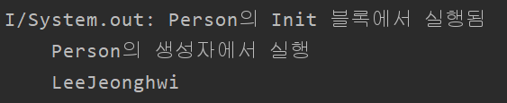
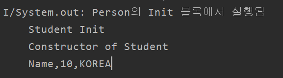

# Class

클래스는 자바의 클래스와 비슷하나, 모르는 부분을 주로 기록함


#### Constructor

자바에서의 생성자는 해당 클래스의 name을 그대로 사용하는 것이었다.

Kotlin에서의 생성자는 기본 생성자 `init`을 사용한다.

```kotlin
class Person(val name:String?){
    var age: Int? = null
    lateinit var address: String
    
    init{
        // 생성자 코드블럭
		println("생성자 코드 실행 :${name}")
    }
}
```

* 기본 생성자는 클래스를 정의하면 자동으로 생성된다.
* 인스턴스를 만들자마자 실행됨!

* 기본생성자는 name을 인자로 전달받아서 자동으로 속성을 추가하도록 함

생성자를 직접 정의할 때에는 `constructor` 를 사용한다.

```kotlin
class Person2{
    var name: String? = null
    var name2: String? = null
    var age: Int? = null
    lateinit var address: String
    
    constructor() {
        println("Called 1st.Constructor ")
    }
    constructor(name:String?){
        println("Called 2nd.Constructor")
        this.name = name
    }
   	constructor(name:String?, age:Int?, address:String):this(naem2){
        ...
    }
}
```


### Inheritance

기본적인 구조는 자바와 같다.

```kotlin
open class Person(val name:String?){
    var age:Int? = null
    var adress:String? = null
    init{
        println("Person의 Init 블록에서 실행됨")
    }
    constructor(name:String?, age:Int?, adress:String?):this(name){
        println("Person의 생성자에서 실행")
        this.age = age
        this.address = address
    }
}
```

Class 인스턴스를 생성할때 constructor인자로 전달하면 `init, constructor` 모두 생성된다.


여기서 `open` 으로 클래스를 만들면 상속으로 사용할 수 있다.

만약 다른 클래스에서 이 클래스를 상속으로 하려할 때 `open` 키워드가 없으면 상속이 이루어지지 않고 에러를 내뱉는다.


자식클래스는 다음과 같이 작성한다.

```kotlin
class Student(val alias:String?): Person(alias){
    
    init {
        println("Student Init")
    }
    constructor(alias:String?,age:Int?,address:String?):this(alias){
        println("Constructor of Student")
        this.age = age
        this.address =address
    }
}
```

* 다음과 같이 출력을 한다.
  
  * 이를 보면 알다시피 Person의 init을 실행하고, Student의 인스턴스를 생성한다.


> 아직 메서드 작성 X