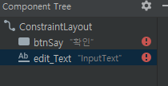
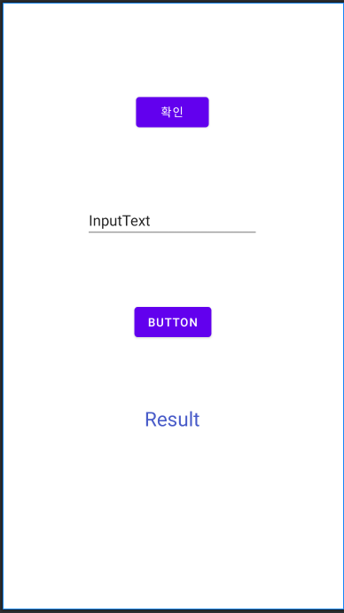

# 입력상자에 입력한 값을 가져와 보여주기


### layout 수정

> activity_main.xml

```xml
<?xml version="1.0" encoding="utf-8"?>
<androidx.constraintlayout.widget.ConstraintLayout xmlns:android="http://schemas.android.com/apk/res/android"
    xmlns:app="http://schemas.android.com/apk/res-auto"
    xmlns:tools="http://schemas.android.com/tools"
    android:layout_width="match_parent"
    android:layout_height="match_parent"
    tools:context=".MainActivity">

    <Button
        android:id="@+id/btnSay"
        android:layout_width="wrap_content"
        android:layout_height="wrap_content"
        android:layout_marginTop="108dp"
        android:text="확인"
        app:layout_constraintEnd_toEndOf="parent"
        app:layout_constraintHorizontal_bias="0.498"
        app:layout_constraintStart_toStartOf="parent"
        app:layout_constraintTop_toTopOf="parent" />

    <EditText
        android:id="@+id/input1"
        android:layout_width="wrap_content"
        android:layout_height="wrap_content"
        android:layout_marginTop="84dp"
        android:ems="10"
        android:inputType="textPersonName"
        android:text="InputText"
        app:layout_constraintEnd_toEndOf="parent"
        app:layout_constraintHorizontal_bias="0.497"
        app:layout_constraintStart_toStartOf="parent"
        app:layout_constraintTop_toBottomOf="@+id/btnSay" />

    <Button
        android:id="@+id/button4"
        android:layout_width="wrap_content"
        android:layout_height="wrap_content"
        android:layout_marginTop="76dp"
        android:text="Button"
        app:layout_constraintEnd_toEndOf="parent"
        app:layout_constraintStart_toStartOf="parent"
        app:layout_constraintTop_toBottomOf="@+id/input1" />

    <TextView
        android:id="@+id/output1"
        android:layout_width="wrap_content"
        android:layout_height="wrap_content"
        android:layout_marginTop="76dp"
        android:text="Result"
        android:textColor="#475AC8"
        android:textColorLink="#FFFFFF"
        android:textSize="24sp"
        app:layout_constraintEnd_toEndOf="parent"
        app:layout_constraintHorizontal_bias="0.498"
        app:layout_constraintStart_toStartOf="parent"
        app:layout_constraintTop_toBottomOf="@+id/button4" />

</androidx.constraintlayout.widget.ConstraintLayout>
```

* Component Tree
  
  * ConstraintLayout은 최상위 Layout, 화면인 activity를 꽉 채우는 layout (제약 layout, 눈에 보이지않음)
  * `btnSay, edit_text`는 **Widget** (눈에 보이는 것)이라고함 
    * constraintLayout은 widget의 부모 layout
    * 다른 자식의 연결점하고 붙일 수 있다.
    * 보통 연결점은 2~3개 정도 연결된다.
  * 레이아웃 구성
    


### Modify MainActivity.kt

> MainActivity.kt

```kotlin
button4.setOnClickListener {
    val inputText = input1.text.toString() // edit Text에 입력한 글자가 있다면 가져오거라!
    output1.text = "Result : $inputText"
}
```

* String 형태로 input1에 입력된 값을 가져오고 output1에 표시해준다.


### 최종 코드

```kotlin
package com.example.android_study

import android.os.Bundle
import android.widget.Toast
import androidx.appcompat.app.AppCompatActivity
import kotlinx.android.synthetic.main.activity_main.*

class MainActivity : AppCompatActivity() {
    override fun onCreate(savedInstanceState: Bundle?) {
        super.onCreate(savedInstanceState)
        setContentView(R.layout.activity_main)

        btnSay.setOnClickListener {
            Toast.makeText(applicationContext,"Button Clicked",Toast.LENGTH_LONG).show()
        }
        button4.setOnClickListener {
            val inputText = input1.text.toString() // edit Text에 입력한 글자가 있다면 가져오거라!
            output1.text = "Result : $inputText"
        }
    }
}
```


