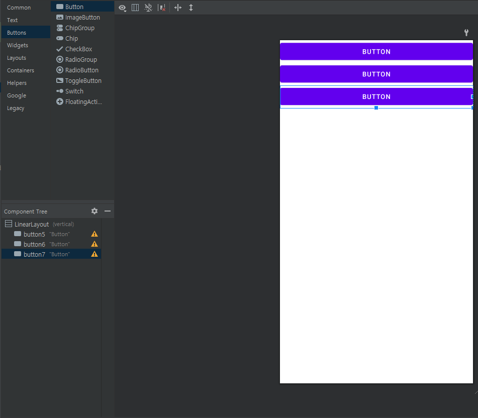
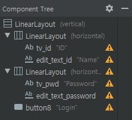
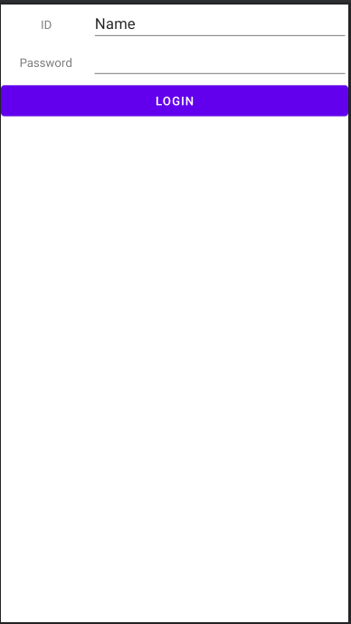

# 위젯과 레이아웃

* 눈에 보이는 것은 Widget
* 다른 것들을 담아두면서 눈에 보이지 않는 것이 레이아웃 (Layout)
* 화면 전체를 차지하는 레이아웃을 최상위 레이아웃이라고 부름

#### LinearLayout

* Box Layout이라고 부르기도 함
* 한쪽 방향으로만 기본적으로 layer를 쌓을 수 있다.
  * orientation Attributes
    * vertical : 위에서부터 쌓는다.
      
      * layout width가 match_parent로 되어있어 "width 를 부모 layout을 꽉 채우라는 뜻"
        * wrap_content 는 content 만큼 크기 키우라는 뜻
      * layout_width, height는 **필수속성**
* 레이아웃을 중첩시키는 것도 가능하다.
  
  * LinearLayout은 각각 layout_height를 wrapContent로 설정해주었다.
  * 결과
    
    * textview(id), Name input 은 LinearLayout1에 속해있고, textview(pwd), pwd input은 LinearLayout2에 속해있다.
    * login button은 최상위 layout인 vertical LinearLayout에 속해있다.

