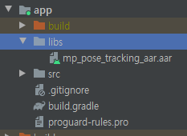
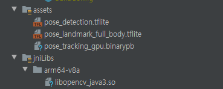

# Mediapipe Pose AAR Build Process

### Build Env

* Ubuntu 20.04 LTS
* Docker

* Mediapipe 0.7.11


## Setting

Mediapipe 공식홈페이지의 `Installing using docker`를 기반으로 구성하였다.

> 윈도우 , WSL2 다 써본 결과 Docker로 하는 것이 가장 올바른 판단이라고 생각하였고, 서버 컴퓨터가 GPU가 달려있어 빌드속도가 더 빨랐기에 서버 컴퓨터의 Docker를 사용함. GPU가 있는 서버가 없어도 괜찮지만 속도는 조금 느림, 그리고 WSL2 (ubuntu) 환경으로 시도를 해도 상관이 없다고 생각됨


Docker를 선택한 이유는 자체적으로 opencv 와 jdk 등 여러 패키지를 설치할 때 에러가 많이 일어나고 어떤 패키지는 설치가 안되기도 했다.

따라서 Mediapipe에서 자체적으로 만들어준 `Dockerfile`로 images 를 만들어 사용함


Container가 만들어졌다면 Container에 Attach 한다.

기본적으로 Android는 따로 설치를 진행해야한다. 그래서 mediapipe 측에서 만들어놓은 setup Shell Script를 쓰는데, ndk(혹은 sdk)가 설치가 잘안되는 경우가 있다.

그래서 안드로이드 홈페이지로 가서 ndk, sdk 링크를 shell script에 수정해주면된다.

> [setup_android_sdk_and_ndk.sh](https://github.com/google/mediapipe/blob/master/setup_android_sdk_and_ndk.sh) 참조


## Build

> mediapipe 순서대로 작성되었음


### AAR build

AAR 파일부터 빌드한다. 빌드 코드는 다음과 같다.

> /mediapipe/examples/android/src/java/com/google/mediapipe/apps/aar_example/BUILD

```shell
load("//mediapipe/java/com/google/mediapipe:mediapipe_aar.bzl", "mediapipe_aar")

mediapipe_aar(
    name = "mp_pose_tracking_aar",
    calculators = ["//mediapipe/graphs/pose_tracking:pose_tracking_gpu_deps"],  --> mediapipe 공식 홈페이지 참고
)
```

* BUILD 파일을 만들어주고 calculators는 `pose_tracking BUILD` 파일을 참고하여 작성한다.

  > pose Tracking BUILD
  >
  > ```shell
  > cc_binary(
  >     name = "libmediapipe_jni.so",
  >     linkshared = 1,
  >     linkstatic = 1,
  >     deps = [
  >         "//mediapipe/graphs/pose_tracking:pose_tracking_gpu_deps", --> 해당 코드를 통해 posetrackinggpu.java 를 빌드하게 됨
  >         "//mediapipe/java/com/google/mediapipe/framework/jni:mediapipe_framework_jni",
  >     ],
  > )
  > ```
  >
  > * 이 코드에서 pose_tracking_gpu_deps를 deps로 사용하므로 graph 폴더에 있는 BUILD를 참고한다.


Bazel AAR 빌드 코드는 다음과 같다.

```shell
bazel build -c opt --host_crosstool_top=@bazel_tools//tools/cpp:toolchain --fat_apk_cpu=arm64-v8a,armeabi-v7a --linkopt="-s" //mediapipe/examples/android/src/java/com/google/mediapipe/apps/aar_example:mp_pose_tracking_aar
```


빌드된 AAR 파일은 android Project의 libs 폴더에 붙여넣는다.



### binary Graph, tflite model

pose tracking BUILD 코드에 따르면 `pose_tracking_gpu.binarypb, pose_landmark_full_body.tflite, pose_detection.tflite` 파일을 `assets` 로 가진다. 

> pose Tracking BUILD file

```shell
android_binary(
    name = "posetrackinggpu",
    srcs = glob(["*.java"]),
    assets = [
        "//mediapipe/graphs/pose_tracking:pose_tracking_gpu.binarypb",
        "//mediapipe/modules/pose_landmark:pose_landmark_full_body.tflite",
        "//mediapipe/modules/pose_detection:pose_detection.tflite",
    ],
    assets_dir = "",
    manifest = "//mediapipe/examples/android/src/java/com/google/mediapipe/apps/basic:AndroidManifest.xml",
    manifest_values = {
        "applicationId": "com.google.mediapipe.apps.posetrackinggpu",
        "appName": "Pose Tracking",
        "mainActivity": ".MainActivity",
        "cameraFacingFront": "False",
        "binaryGraphName": "pose_tracking_gpu.binarypb",
        "inputVideoStreamName": "input_video",
        "outputVideoStreamName": "output_video",
        "flipFramesVertically": "True",
        "converterNumBuffers": "2",
    },
    multidex = "native",
    deps = [
        ":mediapipe_jni_lib",
        "//mediapipe/examples/android/src/java/com/google/mediapipe/apps/basic:basic_lib",
        "//mediapipe/framework/formats:landmark_java_proto_lite",
        "//mediapipe/java/com/google/mediapipe/framework:android_framework",
    ],
)
```

binarypb 파일을 BUILD를 해주어야한다.

해당 파일을 빌드를 위해서는 `graphs/pose_tracking/BUILD` 파일을 참조한다

```shell
cc_library(
    name = "pose_tracking_gpu_deps",
    deps = [
        "//mediapipe/calculators/core:flow_limiter_calculator",
        "//mediapipe/calculators/image:image_properties_calculator",
        "//mediapipe/calculators/util:landmarks_smoothing_calculator",
        "//mediapipe/graphs/pose_tracking/subgraphs:pose_renderer_gpu",
        "//mediapipe/modules/pose_landmark:pose_landmark_gpu",
    ],
)
mediapipe_binary_graph(
    name = "pose_tracking_gpu_binary_graph",
    graph = "pose_tracking_gpu.pbtxt",
    output_name = "pose_tracking_gpu.binarypb",
    deps = [":pose_tracking_gpu_deps"],
)
```

* `pose_tracking_gpu_deps`를 빌드하면 `pose_tracking_gpu.binarypb` 를 output으로 받는다.


Build Code

```shell
bazel build -c opt --copt -DMESA_EGL_NO_X11_HEADERS --copt -DEGL_NO_X11 mediapipe/graphs/pose_tracking:pose_tracking_gpu_deps
```


빌드된 파일을 포함하여 `tflite` 파일을 `assets`에 붙여넣는다.


> libopencv_java3.so 파일은 [opencv github](https://github.com/opencv/opencv/releases/download/3.4.3/opencv-3.4.3-android-sdk.zip) 에서 다운받는다.


이렇게 하면 gradle 빌드 준비를 마쳤다.


gradle dependency 도 추가한다.

```groovy
dependencies {

    implementation "org.jetbrains.kotlin:kotlin-stdlib:$kotlin_version"
    //mediapipe dependencies
    implementation fileTree(dir: 'libs', include: ['*.jar', '*.aar'])
    implementation 'androidx.core:core-ktx:1.3.2'
    implementation 'androidx.appcompat:appcompat:1.2.0'
    implementation 'com.google.android.material:material:1.3.0'
    implementation 'androidx.constraintlayout:constraintlayout:2.0.4'
    testImplementation 'junit:junit:4.12'
    androidTestImplementation 'androidx.test.ext:junit:1.1.0'
    androidTestImplementation 'androidx.test.espresso:espresso-core:3.1.1'
    // MediaPipe deps
    implementation 'com.google.flogger:flogger:0.3.1'
    implementation 'com.google.flogger:flogger-system-backend:0.3.1'
    implementation 'com.google.code.findbugs:jsr305:3.0.2'
    implementation 'com.google.guava:guava:27.0.1-android'
    implementation 'com.google.guava:guava:27.0.1-android'
    implementation 'com.google.protobuf:protobuf-java:3.11.4'
    // CameraX core library
    def camerax_version = "1.0.0-beta10"
    implementation "androidx.camera:camera-core:$camerax_version"
    implementation "androidx.camera:camera-camera2:$camerax_version"
    implementation "androidx.camera:camera-lifecycle:$camerax_version"
}
```

* 해당 코드에서 `androidx.appcomapt.appcompat` 버전을 바꾸었다. 이유는 안드로이드 버전이 올라가면서 layout 을 빌드하는 과정에서 오류가 난다


AndroidManifest.xml 파일에도 카메라 권한을 추가한다.

```xml
<!-- For using the Camera -->
<uses-permission android:name="android.permission.CAMERA"/>
<uses-feature android:name="android.hardware.camera"/>
<uses-feature android:name="android.hardware.camera.autofocus"/>
<!-- For mediapipe -->
<uses-feature android:glEsVersion="0x00020000" android:required="true"/>
```


최종 코드는 github 참조