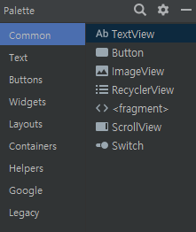

# 안드로이드 공부과정 #1

설치과정은 Skip


### Create Project - Empty Activity

프로젝트를 API 29 Level, Empty Activity Template로 생성하였다.

여기서 주의깊게 봐야할 파일은 `activity_main.xml, MainActivity.kt` 이다.

> MainActivity.kt

```kotlin
package com.example.android_study

import androidx.appcompat.app.AppCompatActivity
import android.os.Bundle

class MainActivity : AppCompatActivity() {
    override fun onCreate(savedInstanceState: Bundle?) {
        super.onCreate(savedInstanceState)
        setContentView(R.layout.activity_main)
    }
}
```

* Empty Activity 의 구성은 다음과 같다.
* `setContentView(R.layout.activity_main)` 는 activity_main.xml을 참조한다.

>Change Design + Blueprint mode
>
>* Blueprint mode - 레이아웃의 외각선만 나타내는 청사진 모드 (실루엣만 보여줌)
>* Design Mode - 실제 앱 실행화면


### Layout

> activity_main.xml

```xml
<?xml version="1.0" encoding="utf-8"?>
<androidx.constraintlayout.widget.ConstraintLayout xmlns:android="http://schemas.android.com/apk/res/android"
    xmlns:app="http://schemas.android.com/apk/res-auto"
    xmlns:tools="http://schemas.android.com/tools"
    android:layout_width="match_parent"
    android:layout_height="match_parent"
    tools:context=".MainActivity">

    <TextView
        android:layout_width="wrap_content"
        android:layout_height="wrap_content"
        android:text="Hello World!"
        app:layout_constraintBottom_toBottomOf="parent"
        app:layout_constraintLeft_toLeftOf="parent"
        app:layout_constraintRight_toRightOf="parent"
        app:layout_constraintTop_toTopOf="parent" />

</androidx.constraintlayout.widget.ConstraintLayout>
```

* 레이아웃을 설정할 수 있는 xml 파일이다.
* 해당 파일은 android Studio 에서 Code, Design, Split 모드로 볼 수 있다.
* Design 탭에서는 Drag & Drop으로 레이아웃을 구성할 수 있다.
  

#### Constraint

* 해당 컴포넌트를 클릭하면 Contsraint를 조절할 수 있는데, Constraint는 다른 컴포넌트와의 거리를 의미한다.
  
  * `+` 버튼을 눌르면 Constraint를 조절하는데, 세 가지 모드가 존재한다.
    * Wrap Content : 위젯 안쪽의 내용물에 크기를 맞춘다.
    * Fixed  : 가로세로 속성 필드에 입력된 크기에 맞게 가로세로 고정
    * Match Constraint : 크기를 제약 조건인 Constraint 연결부에 맞춘다.
      


#### connect button

Add Gradle scripts

> build.gradle

```groovy
plugins {
    id 'com.android.application'
    id 'kotlin-android'
    id 'kotlin-android-extensions' // Add this code
}
```

* 플러그인을 추가해준다.
* 지금 현재 `kotlin-android-extensions`는 자동으로 제공하는 기능이 사라졌다.

```kotlin
package com.example.android_study

import android.os.Bundle
import android.widget.Toast
import androidx.appcompat.app.AppCompatActivity
import kotlinx.android.synthetic.main.activity_main.*

class MainActivity : AppCompatActivity() {
    override fun onCreate(savedInstanceState: Bundle?) {
        super.onCreate(savedInstanceState)
        setContentView(R.layout.activity_main)

        btnSay.setOnClickListener {
            Toast.makeText(applicationContext,"Button Clicked",Toast.LENGTH_LONG).show()
        }
    }
}
```

* `import kotlinx.android.synthetic.main.activity_main.*`

  * `findviewid` 없이 component_id에 접근할 수 있게해주는 패키지

* ```kotlin
  btnSay.setOnClickListener {
      Toast.makeText(applicationContext,"Button Clicked",Toast.LENGTH_LONG).show()
  }
  ```

  * 레이아웃에 선언된 btnSay라는 ID에 Listener를 추가한다.
  * `Toast` : Alert Message를 출력하는 함수
  * btnSay 버튼을 클릭하면 "ButtonClicked" 라고 메시지를 출력한다.
    


### 동작원리


* xml파일에 작성된 버튼은 앱을 실행되는 단계(inflation)에서 메모리에 객체화 해주고, 버튼을 눌렀을 때 기능 동작 소스 코드가 연결되어서 동작함

  * 메모리에 버튼 객체가 어디 만들어진지 모르기 때문에 `id`로 찾는 과정이 필요함

    >  `id`를 꼭 기억해야함!