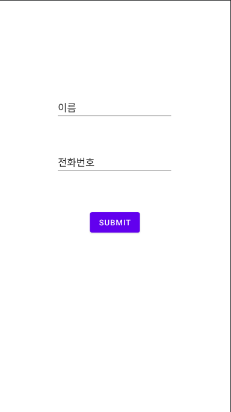

# Value and Data Type

해당 테스트는 다음과 같은 기능을 만든다.

* 이름, 전화번호에 입력값이 들어오고, SUBMIT을 누르면 해당 입력값을 name,mobile 변수에 넣고 Toast로 띄워준다.


1. 레이아웃 구성

> activity_main.xml

```xml
<?xml version="1.0" encoding="utf-8"?>
<androidx.constraintlayout.widget.ConstraintLayout xmlns:android="http://schemas.android.com/apk/res/android"
    xmlns:app="http://schemas.android.com/apk/res-auto"
    xmlns:tools="http://schemas.android.com/tools"
    android:layout_width="match_parent"
    android:layout_height="match_parent"
    android:orientation="vertical"
    tools:context=".MainActivity">

    <EditText
        android:id="@+id/numberinput"
        android:layout_width="wrap_content"
        android:layout_height="wrap_content"
        android:layout_marginTop="52dp"
        android:ems="10"
        android:inputType="textPersonName"
        android:text="전화번호"
        app:layout_constraintEnd_toEndOf="parent"
        app:layout_constraintHorizontal_bias="0.497"
        app:layout_constraintStart_toStartOf="parent"
        app:layout_constraintTop_toBottomOf="@+id/nameinput" />

    <EditText
        android:id="@+id/nameinput"
        android:layout_width="wrap_content"
        android:layout_height="wrap_content"
        android:layout_marginTop="168dp"
        android:ems="10"
        android:inputType="textPersonName"
        android:text="이름"
        app:layout_constraintEnd_toEndOf="parent"
        app:layout_constraintHorizontal_bias="0.497"
        app:layout_constraintStart_toStartOf="parent"
        app:layout_constraintTop_toTopOf="parent" />

    <Button
        android:id="@+id/submit"
        android:layout_width="wrap_content"
        android:layout_height="wrap_content"
        android:layout_marginTop="60dp"
        android:text="submit"
        app:layout_constraintEnd_toEndOf="parent"
        app:layout_constraintStart_toStartOf="parent"
        app:layout_constraintTop_toBottomOf="@+id/numberinput" />
</androidx.constraintlayout.widget.ConstraintLayout>
```

실제 구성은 다음과 같다.


* 레이아웃 구성을 편하게 하기위해 Constraint Layout을 사용하였다.


2. `Activity_main.kt` 을 작성해준다.

```kotlin
package com.example.android_study

import android.os.Bundle
import android.util.Log
import android.widget.Toast
import androidx.appcompat.app.AppCompatActivity
import kotlinx.android.synthetic.main.activity_main.*

class MainActivity : AppCompatActivity() {
    var name:String = ""
    var mobile:String = ""
    override fun onCreate(savedInstanceState: Bundle?) {
        super.onCreate(savedInstanceState)
        setContentView(R.layout.activity_main)
        submit.setOnClickListener {
            name = nameinput.text.toString()
            mobile = numberinput.text.toString()

            Toast.makeText(applicationContext,"Name : ${name}, Mobile : ${mobile}",Toast.LENGTH_LONG).show()
            Log.d("TEST TAG","name : ${name}, mobile : ${mobile}")
        }
    }
}
```

```kotlin
var name:String = ""
var mobile:String = ""
```

* `name , mobile` 변수를 `String` 타입으로 해준다. 해당 변수는 입력된 값을 저장하는 변수이다.
* `log`를 `debug` 단계로 찍어서 한번 테스트 해보았다.


### val & var

`Kotlin`은 **타입 기반의 언어** 이다.

일반적으로 변수를 만들 때에는 기본적으로 자료형을 함께 명시함

> ex) `int a = 0;`

`Kotlin`은 `var` 과 `val`로 선언이 되는데, `var` 은 읽고 쓰기가 가능한 변수 타입이고, `val`은 읽기 전용 변수 타입이다.

* `val` 타입은 변경이 되지 않는다.

* `:` 을 이용해서 자료형을 명시해준다.
  * 꼭 자료형을 명시해주지 않아도 되는데 이때에는 `Type Inference` (자료형 추론)을 하여 빌드되는 과정에서 자료형을 결정한다.

  * 이때에는 꼭 초깃값을 넣어야한다. 

  > ex)
  >
  > ```kotlin
  > var a // (X)
  > var a = 10 //(O)
  > ```

* 만약 변수를 선언만 하고 싶을 시에는 `lateinit`을 사용해야한다.

  > ex)
  >
  > ```kotlin
  > var nameS:String // E: Property must be initialized or be abstract
  > lateinit var nameS:String
  > ```


### Nullable type

변수를 정의할 때, `Null` 값을 가질 수 있는지 없는지에 대해 사용자가 직접 설정할 수 있다.

* Nullable

  * `?` 연산자를 자료형 뒤에 붙여준다

    > ex) `var nameS:String?`

* Unwrapping

  * `!!` 기호를 사용하여 property를 강제로 `not null`로 바꿔주는 연산자

    > ex) `var nameS:String = s!!`

  * `!!` 연산자는 cascading 해서 쓰지 않도록 하자!

* Safe Call

  * 어떠한 변수를 강제로 Unwrapping을 했는데, 해당 변수가 null 인 경우 에러를 발생시키고 프로그램이 죽어버린다.

  * 이를 방지하기 위해 safe call을 지원한다.

    > ex)
    >
    > ```kotlin
    > val nameLength = name?.length
    > ```
    >
    > * 이 경우에 name이 null인 경우 length를 구할 수 없으므로 `NPE` 가 발생하는데 `?.`로 하여금 미리 null을 검사한다.

  * Null 인 경우에도 기능을 실행하도록 할것이라면 `?:` 연산자를 사용한다

    * 이는 엘비스 연산자(Elvis Operator) 라고한다.

    > ex)
    >
    > ```kotlin
    > val nameLength2 = name?.length ?: 0
    > ```
    >
    > * 이 경우 name이 null인지 체크하고 null 이 아니라면 length를 호출하는데, null 이라면 0을 assign 한다.


### Any, is , as

Any 자료형은 어떤 값이라도 넣을 수 있다. (충분한 메모리 공간을 준다)

> ex) `val input1:Any`

* 하지만 이 자료형은 어떤 자료형인지 코드에서 명시하지 않기 때문에, 어떤 자료형의 값인지 확인하고 싶을 때가 자주 생긴다.

* 이 경우에 `is`연산자를 사용해서 자료형이 무엇인지 알아낼 수 있고, `as`연산자로 변환을 할 수 있다.

  > ex) 
  > `if (input1 is int)`
  >
  > `input1 as String`
  >
  > * 하지만 `as` 연산자가 타입을 변환하려 할 때 변환이 불가능한 경우라면 `exception`을 발생시킨다.
  > * 그래서 `as` 연산자는 일반적으로 `?` 연산자와 자주 사용된다.


### const, companion object

* 변하지않는 값인 `const` , 이는 java에서 `final static` 과 비슷하다.
* `companion object` 는 자바에서 정적 변수/메서드를 사용하는 것과 동일하게 사용할 수 있다.
  * static 처럼 동작하는 것처럼 보일뿐이지 static은 아니다.
  * 클래스 내에서 companion object는 딱 하나만 쓸 수 있다.
  * 따라서 정적변수들은 대부분 companion object에 다 넣기도 한다.
  * 상속관계에서 companion object 멤버는 같은 이름일 경우 가려진다 (shadowing)
  * 얘도 `객체` 이다!

```kotlin
class MyClass3{
    companion object MyCompanion{
        val prop:String? = "I'm Companion..Object..." // 정적변수 처럼 접근
        fun method() = "I'm Method of Companion object" // 정적메소드 처럼 접근
    }
}
fun main(args : Array<String>){
    println(MyClass3.MyCompanion.prop) //이와 같이 접근이 가능하다.
}
```


### 변수에 값을 저장한 후 화면에 출력하기

> activity_main.xml

```xml
<?xml version="1.0" encoding="utf-8"?>
<androidx.constraintlayout.widget.ConstraintLayout xmlns:android="http://schemas.android.com/apk/res/android"
    xmlns:app="http://schemas.android.com/apk/res-auto"
    xmlns:tools="http://schemas.android.com/tools"
    android:layout_width="match_parent"
    android:layout_height="match_parent"
    android:orientation="vertical"
    tools:context=".MainActivity">

    <EditText
        android:id="@+id/num1"
        android:layout_width="113dp"
        android:layout_height="43dp"
        android:layout_marginTop="48dp"
        android:ems="10"
        android:inputType="textPersonName"
        app:layout_constraintEnd_toEndOf="parent"
        app:layout_constraintHorizontal_bias="0.11"
        app:layout_constraintStart_toStartOf="parent"
        app:layout_constraintTop_toTopOf="parent" />

    <EditText
        android:id="@+id/num2"
        android:layout_width="113dp"
        android:layout_height="43dp"
        android:layout_marginTop="24dp"
        android:ems="10"
        android:inputType="textPersonName"
        app:layout_constraintEnd_toEndOf="parent"
        app:layout_constraintHorizontal_bias="0.11"
        app:layout_constraintStart_toStartOf="parent"
        app:layout_constraintTop_toBottomOf="@+id/num1" />

    <EditText
        android:id="@+id/num3"
        android:layout_width="113dp"
        android:layout_height="43dp"
        android:layout_marginTop="24dp"
        android:ems="10"
        android:inputType="textPersonName"
        app:layout_constraintEnd_toEndOf="parent"
        app:layout_constraintHorizontal_bias="0.11"
        app:layout_constraintStart_toStartOf="parent"
        app:layout_constraintTop_toBottomOf="@+id/num2" />

    <EditText
        android:id="@+id/num4"
        android:layout_width="113dp"
        android:layout_height="43dp"
        android:layout_marginTop="24dp"
        android:ems="10"
        android:inputType="textPersonName"
        app:layout_constraintEnd_toEndOf="parent"
        app:layout_constraintHorizontal_bias="0.11"
        app:layout_constraintStart_toStartOf="parent"
        app:layout_constraintTop_toBottomOf="@+id/num3" />

    <EditText
        android:id="@+id/num5"
        android:layout_width="113dp"
        android:layout_height="43dp"
        android:layout_marginTop="20dp"
        android:ems="10"
        android:inputType="textPersonName"
        app:layout_constraintEnd_toEndOf="parent"
        app:layout_constraintHorizontal_bias="0.11"
        app:layout_constraintStart_toStartOf="parent"
        app:layout_constraintTop_toBottomOf="@+id/num4" />

    <Button
        android:id="@+id/calcButton"
        android:layout_width="wrap_content"
        android:layout_height="wrap_content"
        android:layout_marginTop="40dp"
        android:text="Calc"
        app:layout_constraintEnd_toEndOf="parent"
        app:layout_constraintHorizontal_bias="0.139"
        app:layout_constraintStart_toStartOf="parent"
        app:layout_constraintTop_toBottomOf="@+id/num5" />

    <TextView
        android:id="@+id/resultView"
        android:layout_width="wrap_content"
        android:layout_height="wrap_content"
        android:text="결과 : "
        android:textColor="#0628E3"
        android:textSize="30sp"
        app:layout_constraintBottom_toBottomOf="parent"
        app:layout_constraintEnd_toEndOf="parent"
        app:layout_constraintHorizontal_bias="0.57"
        app:layout_constraintStart_toStartOf="parent"
        app:layout_constraintTop_toTopOf="parent"
        app:layout_constraintVertical_bias="0.315" />
</androidx.constraintlayout.widget.ConstraintLayout>
```

> MainActivity.kt

```kotlin
package com.example.android_study

import android.os.Bundle
import androidx.appcompat.app.AppCompatActivity
import kotlinx.android.synthetic.main.activity_main.*

class MainActivity : AppCompatActivity() {

    /*num1,num2,num3,num4,num5, calcButton , resultView */
    override fun onCreate(savedInstanceState: Bundle?) {
        super.onCreate(savedInstanceState)
        setContentView(R.layout.activity_main)
        calcButton.setOnClickListener {

            val num_1 = if (num1.text.toString() == "") 0 else num1.text.toString().toInt()
            val num_2 = if (num2.text.toString() == "") 0 else num2.text.toString().toInt()
            val num_3 = if (num3.text.toString() == "") 0 else num3.text.toString().toInt()
            val num_4 = if (num4.text.toString() == "") 0 else num4.text.toString().toInt()
            val num_5 = if (num5.text.toString() == "") 0 else num5.text.toString().toInt()
            val result:Int = num_1+num_2+num_3+num_4+num_5
            resultView.setText("결과 : "+result.toString())
        }
    }
}
```

* Kotlin 에는 삼항연산자가 없고 표현식으로 쓸 수 있다.
* `num(n).text.toString() == ""` 이면 0을 assign 하고 아니면 입력받은 숫자를 int로 저장하고 계산!

> 여기서 나는 `num1.text?.toString()` 으로 `?` 연산자로 체크해주려했는데, 빈값은 `""` 로 나오고 `null`로 나오지 않는다.


### References

[Companion Object](https://www.bsidesoft.com/8187)